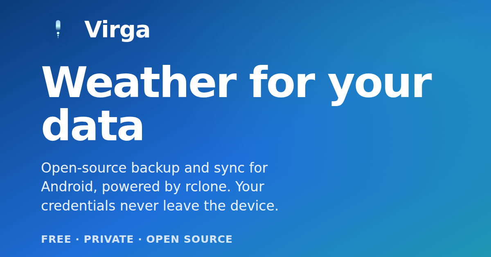

<div align="center">



# Virga

**Weather for your data.** A modern Android app that backs up and syncs your phone's
storage — including the microSD root — to any cloud, powered by
[rclone](https://rclone.org). One-way and two-way sync, scheduled in the background,
with your credentials encrypted on the device.

[](https://github.com/lusky3/virga/actions/workflows/build.yml)
[](LICENSE)
[](https://github.com/lusky3/virga/releases)
[-3DDC84.svg?logo=android&logoColor=white)](https://github.com/lusky3/virga)
[](https://github.com/lusky3/virga)
[](https://rclone.org)
[](https://lusky3.github.io/virga/)

**Package:** `app.lusk.virga` · **License:** Apache 2.0 · **minSdk:** 26 (Android 8.0)

</div>

> Status: 0.1.0 pre-release. The engine, data layer, background sync, and the
> full screen set are implemented, tested, and build to a signed, installable
> APK. See [Project status](#project-status) for what's done and what's still
> open.

## How it works

Virga ships a per-ABI rclone binary inside the APK (as `lib/<abi>/librclone.so`,
which Android extracts as an executable). On demand it launches rclone in
remote-control daemon mode bound to a random localhost port with random
per-session credentials, and drives all operations over rclone's authenticated
JSON RC API. rclone owns per-file delta detection; Virga owns task definitions,
scheduling, and run history (in an encrypted-config + Room setup).

```
WorkManager (periodic) ──► SyncWorker (foreground dataSync) ──► rclone RC daemon
                                   │                                  ▲
                                   └── progress ──► notification      └── localhost HTTP+JSON
```

## Architecture

Multi-module, Kotlin-only, Jetpack Compose + Material 3, Hilt DI, Room,
DataStore, WorkManager, Coroutines/Flow.

| Module | Responsibility |
|--------|----------------|
| `app` | Application, single Activity, Compose navigation, DI aggregation |
| `core:common` | Shared domain models, errors, dispatchers |
| `core:designsystem` | Theme (color, type, motion) and reusable Compose components |
| `core:database` | Room entities/DAOs (remotes, tasks, runs, conflicts) |
| `core:datastore` | App preferences (DataStore) |
| `core:rclone` | rclone binary mgmt, RC daemon lifecycle, RC API client, engine, encrypted config |
| `core:data` | Repositories tying the data sources together |
| `sync-worker` | WorkManager worker, foreground service, scheduler, boot receiver |
| `feature:sync` | Sync task list + editor, sync history, conflict resolution |
| `feature:stats` | Home tab: lifetime transfer/run stats |
| `feature:remotes` | Remote management (OAuth + manual config + config import) |
| `feature:explorer` | File browser for remote contents |
| `feature:settings` | App settings |

Build-support modules sit alongside these: `rclone-build` cross-compiles the
native binary, and `benchmark` holds the Macrobenchmark + baseline-profile run.

The full design rationale lives in [`specs/virga-android/spec.md`](specs/virga-android/spec.md).

## Building

Prerequisites:

- JDK 21
- Android SDK (platform 36, build-tools 36) + NDK `27.2.12479018`
- Go 1.25+ (only needed if you don't have prebuilt rclone binaries in
  `core/rclone/src/main/jniLibs/`)

```bash
# Build the FOSS debug APKs (per-ABI + universal). The :rclone-build module
# cross-compiles librclone.so on demand if the binaries are missing; if they
# are already on disk (e.g. checked in for contributor convenience) the
# Exec task is a no-op.
./gradlew assembleFossDebug

# Force a rebuild of the rclone binaries:
rm -rf core/rclone/src/main/jniLibs && ./gradlew :rclone-build:buildRcloneBinaries

# Tests / lint
./gradlew test :app:lintFossDebug

# Instrumented + end-to-end sync tests (require a running emulator/device)
./gradlew :app:connectedFossDebugAndroidTest
```

Outputs land in `app/build/outputs/apk/foss/debug/`. Release APKs go to
`app/build/outputs/apk/foss/release/` and are unsigned by default — see the
[Release workflow](#release) for the keystore-signing CI path.

### Flavors & distribution

- `foss` — F-Droid and GitHub releases, no proprietary dependencies.
- `play` — Google Play.

ABI splits produce `arm64-v8a`, `armeabi-v7a`, and `x86_64` APKs plus a
universal APK for sideloading. The Play build uses an AAB so Google delivers a
single matching ABI per device.

## Storage permissions

rclone needs real filesystem paths, which `content://` SAF URIs cannot provide.
SD-card sync therefore requires `MANAGE_EXTERNAL_STORAGE`:

- **F-Droid / GitHub:** granted directly, no restrictions.
- **Play Store:** requires the declaration form; if rejected, the Play build is
  limited to internal storage and SD-card sync needs the F-Droid/GitHub APK.

## OAuth / BYO credentials

Virga ships an in-app OAuth 2.0 + PKCE flow for **Google Drive, OneDrive, and
Dropbox**: tap a provider chip in the Add-remote dialog → Custom Tabs opens the
provider's sign-in page → the redirect comes back to `OAuthRedirectActivity` →
the code is exchanged for tokens and a remote is created via rclone's RC API.
State is validated, PKCE binds the code to a verifier kept in-process, and no
client secret ships in the APK.

The redirect URI differs by provider. Google's Android OAuth client only accepts
a reverse-DNS scheme derived from the client ID, so Google Drive uses that.
Microsoft and Dropbox accept an HTTPS redirect, so they use a verified Android
App Link (`autoVerify`, backed by `docs/well-known/assetlinks.json` served from
the site); the OS routes the callback straight back into the app with no
scheme-hijack window. An earlier build used a `virga://` custom scheme for these,
which the App Link replaced.

| Provider | Redirect URI |
|---|---|
| Google Drive | `com.googleusercontent.apps.<client-id-prefix>:/oauth2redirect` (auto-derived) |
| OneDrive | `https://lusk.app/virga/oauth/callback` |
| Dropbox | `https://lusk.app/virga/oauth/callback` |

### Registering your own client IDs

OAuth client IDs are public-by-design for PKCE mobile clients but they bind
the redirect to your specific developer account. They are **not** checked
into git. To provide your own:

1. Register a client with the provider:
   - **Google:** Cloud Console → APIs & Services → Credentials → Create
     credentials → **OAuth client ID** → **Android**. Package name:
     `app.lusk.virga` (or `app.lusk.virga.debug` for debug builds). SHA-1:
     `keytool -list -v -keystore <your.jks> -alias <alias>`. Under
     **Advanced settings**, **enable Custom URI scheme**. Enable the **Google
     Drive API** for the project, and add your test Google account under
     **OAuth consent screen → Test users**.
   - **Microsoft:** Azure Portal → App registrations → New registration →
     register `https://lusk.app/virga/oauth/callback` as a Web/SPA redirect.
     Point your own App Link domain there if you fork (update the manifest
     intent-filter host and host your own `assetlinks.json`).
   - **Dropbox:** developers.dropbox.com → My apps → Create app → Scoped
     access → Full Dropbox → add `https://lusk.app/virga/oauth/callback`.

2. Add the client IDs to `local.properties` (already gitignored):

   ```properties
   oauthClientId.gdrive=123-abc.apps.googleusercontent.com
   oauthClientId.onedrive=…
   oauthClientId.dropbox=…
   ```

   CI can use env vars instead: `VIRGA_OAUTH_CLIENT_ID_GDRIVE`,
   `VIRGA_OAUTH_CLIENT_ID_ONEDRIVE`, `VIRGA_OAUTH_CLIENT_ID_DROPBOX`.

3. Rebuild. The matching Google reverse-DNS redirect-URI scheme is wired into
   `OAuthRedirectActivity` via a manifest placeholder at build time.

### Alternatives if you don't want to register a client

- **Import an `rclone.conf`** authorized on desktop — Remotes screen →
  **Import**. Works for any backend, including pre-authorized OAuth remotes.
- **Manual config** for credential-based backends (S3, WebDAV, SFTP, …):
  Remotes → **+** → fill in type and `key=value` parameters.

## Release

Tagging a commit with `vX.Y.Z` (or running the `Release` workflow manually)
builds the four FOSS release APKs (`arm64-v8a`, `armeabi-v7a`, `x86_64`,
universal), signs them with a keystore stored in repo secrets, generates a
`SHA256SUMS.txt`, and publishes them as a GitHub Release with auto-generated
notes. See [`.github/workflows/release.yml`](.github/workflows/release.yml).

The workflow reads these from the `production` environment. The keystore and
its passwords are secrets; the alias is non-sensitive, so it's an Actions
**variable** (`vars.RELEASE_KEY_ALIAS`), not a secret.

| Name | Type | Purpose |
|---|---|---|
| `RELEASE_KEYSTORE_BASE64` | secret | `base64 -w0 your.jks` |
| `RELEASE_KEYSTORE_PASSWORD` | secret | keystore password |
| `RELEASE_KEY_PASSWORD` | secret | key password |
| `RELEASE_KEY_ALIAS` | variable | key alias inside the store |
| `OAUTH_CLIENT_ID_{GDRIVE,ONEDRIVE,DROPBOX}` | secret | OAuth client IDs (optional; empty disables the matching chip) |

A tag-triggered release **will not publish unsigned APKs**: after the build, a
gate fails the run if any `*-unsigned.apk` is present, so missing or wrong
keystore config breaks the release rather than shipping unsigned. Release tags
must match `vMAJOR.MINOR(.PATCH)(-suffix)?`; the workflow rejects anything else,
which also blocks shell injection via a crafted tag.

Per-release notes can be written ahead of time at `docs/release/<tag>.md`; if
present they become the GitHub Release body (otherwise the body is auto-
generated from commits since the previous tag).

## Project status

Implemented and verified:

- ✅ Multi-module scaffold → installable APKs (all ABIs)
- ✅ rclone cross-compile pipeline as a Gradle module (`:rclone-build`)
- ✅ Data layer: Room, DataStore, Keystore-encrypted rclone.conf
- ✅ RcloneEngine: daemon lifecycle, RC API client, sync/bisync/list/config
- ✅ Storage access (MANAGE_EXTERNAL_STORAGE + volume enumeration)
- ✅ Background sync: WorkManager + foreground `dataSync` worker + scheduler + boot receiver
- ✅ UI: Home stats tab, sync task list/editor, remotes (OAuth + manual +
  import + delete), file browser, sync history, conflict resolution, settings,
  4-step onboarding — on a shared design system (`core:designsystem`)
- ✅ OAuth 2.0 + PKCE browser flow (Custom Tabs) for Google Drive, OneDrive, and
  Dropbox; Google via reverse-DNS scheme, the rest via a verified App Link —
  see [OAuth / BYO credentials](#oauth--byo-credentials)
- ✅ Opt-in, redacting crash reporting (Sentry, off until the user enables it)
- ✅ Unit tests across engine, RC client, OAuth, ViewModels, scheduler, etc.,
  plus Roborazzi screenshot tests
- ✅ Instrumented tests including an **end-to-end real-rclone sync** that
  proves the bundled binary, daemon, RC API, and sync engine all work on device
- ✅ R8-minified release build with a generated baseline profile; cold-start ~2 s
- ✅ CI: build + test + CodeQL on every PR; tag-driven signed release workflow
- ✅ Showcase site deployed to GitHub Pages from `gh-pages/` via Actions
- ✅ Distribution flavors (`foss` allows BYO OAuth + advertises SD-card sync;
  `play` softens SD-card messaging)

Outstanding:

- ⏳ First-party release OAuth clients (the bundled ones are debug-registered, so
  release builds need BYO keys or `rclone.conf` import for cloud OAuth)
- ⏳ Play Store / F-Droid listing assets (screenshots, descriptions)
- ⏳ Baseline-profile measurement on physical hardware for the real startup delta

See [`specs/virga-android/tasks.md`](specs/virga-android/tasks.md) for the full task breakdown.

## License

Apache 2.0 — see [LICENSE](LICENSE). Clean-room rewrite; no GPL code copied.
rclone is distributed under its own MIT license.
